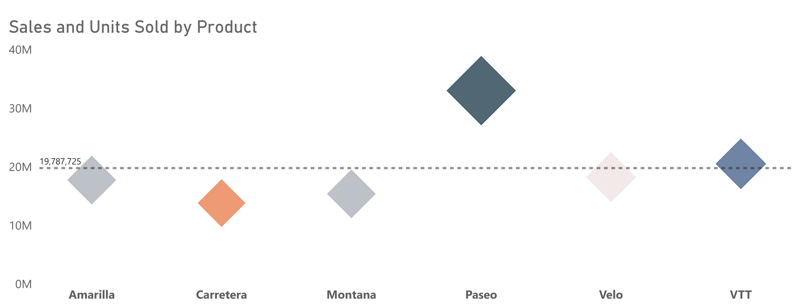
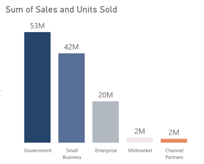
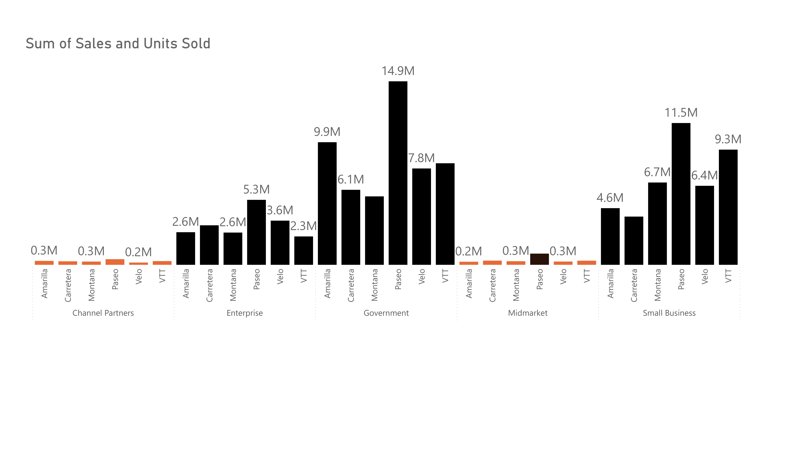
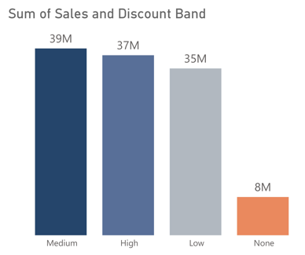
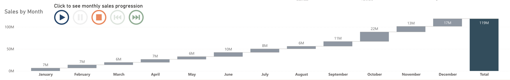
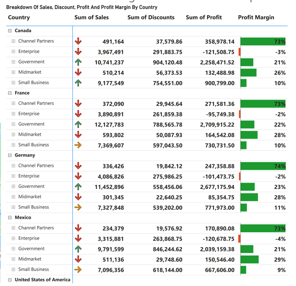

# Sales-And-Financial-Performance-Analysis

  
  

# About The Dataset
The dataset I used for this project is the sample dataset available on Power BI desktop canvas. It contain 16 columns and 700 rows, it contained sales record for the year 2013 and 2014. This dataset contains sales and financial information related to various products across different segments and countries. The data includes detailed information on sales performance, costs, and profits over time. Below is a description of each column:

**Segment**: Indicates the business segment or division to which the product or sale belongs. 

**Country**: Specifies the country where the sale occurred or where the product was sold. 

**Product**: Denotes the specific product that was sold. 

**Discount band**: Represents the discount tier or range applied to the sales price of the product. 

**Units sold**: The number of units of the product sold.

**Manufacturing Price**: The cost incurred to manufacture one unit of the product. 

**Sales Price**: The price at which the product is sold to the customer. 

**Gross sales**: The total sales amount before any discounts are applied. 

**Discount**: The total discount amount applied to the gross sales. 

**Sales**: The net sales amount after applying the discounts.

**COGS (Cost of Goods Sold)**: The direct cost attributable to the production of the goods sold. 

**Profit**: The financial gain calculated as Sales - COGS. 

**Date**: The specific date when the sale was recorded. 

**Month number**: Represents the numerical month of the month.

**Month name**: The name of the month.

**Year**: The year in which the sale occurred. 

# Data Cleaning and Transformation
The dataset was clean, so no data cleaning was required. However, I performed some necessary transformations for the analysis. First, I used the DAX formula Profit Margin = DIVIDE(SUM(financials[Profit]), SUM(financials[Sales]), 0) to calculate the profit margin, which helps understand the overall profitability of the business. Additionally, I calculated the cost of goods sold (COGS) month-over-month (MoM%) and year-over-year, as well as sales and units sold on a similar time basis.

    IF(
    ISFILTERED('financials'[Date]),
    ERROR("Time intelligence quick measures can only be grouped or filtered by the Power BI-provided date hierarchy
    or primary date column."),
    VAR __PREV_MONTH = 
        CALCULATE(
            SUM('financials'[COGS]), 
            DATEADD('financials'[Date].[Date], -1, MONTH)
        )
    RETURN DIVIDE(SUM('financials'[COGS]) - __PREV_MONTH, __PREV_MONTH)
  )
  While I prefer not to overwhelm the report with DAX formulas, similar modifications can be applied to calculate
  MoM% and year-over-year percentages for sales and units sold.
  
# Purpose Of The Analysis
The purpose of this analysis was to gain insights into sales performance across different products, segments, discount bands, months, and countries. By examining these dimensions, the analysis aimed to:
1.	Identify Top and Poorly Performing Products.
2.	Assess Segment Performance.
3.	Evaluate Discount Effectiveness.
4.	Understand Seasonal Trends.
5.	Analyze Geographic Profitability.

   
From the initial visualization displaying sales and units sold by product above, it is evident that Paseo leads with total sales reaching $33,011,143 and 338,239 units sold. Conversely, the least performing product in this category is Carretera, which sold a total of 13,815,307 units and recorded 146,846 units sold.

  
Analysis of sales by segment reveals that the government segment performs the best, achieving total sales of $52,504,260, representing 44% of the segment's total sales. Following closely is the small business segment with $42,427,918 in sales, accounting for 35%. In contrast, channel partners recorded the lowest performance with sales totaling $1,800,593, representing just 1.5% of the overall sales, indicating a need for improvement.

  
 Passeo is the highest-selling product across all segments, whereas Amarilla has the lowest sales in the Channel Partner, Enterprise, and Midmarket segments. In the Government segment, Carretera, Montana is the least-selling product.
 
  
Regarding sales by discount band, the medium discount band leads with sales totaling $38,780,430, capturing 32% of the total sales within the discount bands. The high discount band follows with $37,372,482 in sales, representing 31% of total sales. Conversely, the none discount band had the lowest performance with $7,943,600 in sales, accounting for 6.69% of the total.

  
In terms of monthly sales, October emerged as the highest performing month with $22 million in sales, followed by December with $17 million.
 
 
Analyzing sales, discount, profit, and margin by country, France stands out as the most profitable country with a margin of 16%. This margin is 2% higher than Canada, which led in total sales during the analyzed period.

# Insight
1.	Product Performance: Paseo leads in sales and units sold, while Carretera is the least performing product.
2.	Segment Performance: The government segment dominates with 44% of total sales, and channel partners are the least performing with just 1.5%.
3.	Discount Strategy: Medium discounts drive the most sales (32%), while no discounts are least effective (6.69%).
4.	Seasonal Sales: October has the highest sales at $22 million, followed by December at $17 million.
5.	Country Profitability: France has the highest profit margin at 16%, while Canada has the highest sales but a slightly lower profit margin.
6.	
# Recommendation
1. Enhance marketing for Carretera with targeted campaigns to boost sales.
2.  Focus on government and small business segments by investing in customized solutions. 
3. Revise channel partner strategy with added support and incentives. 
4. Optimize discount strategies by expanding effective discount bands and reassessing products without discounts.
5. Leverage strong sales months like October and December for major campaigns, and improve profit margins in high-sales countries by reducing costs and optimizing pricing.

